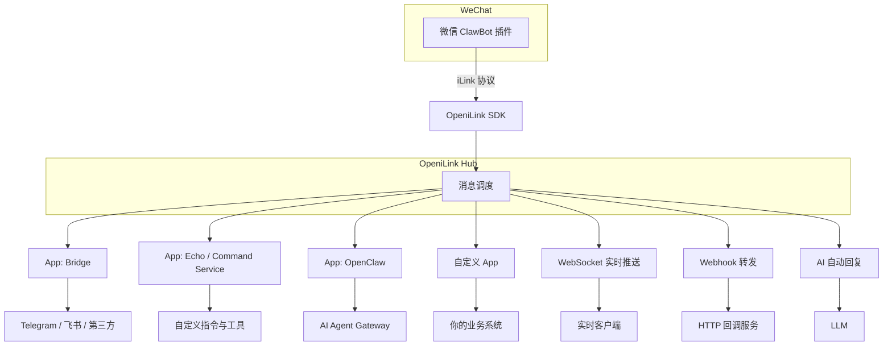
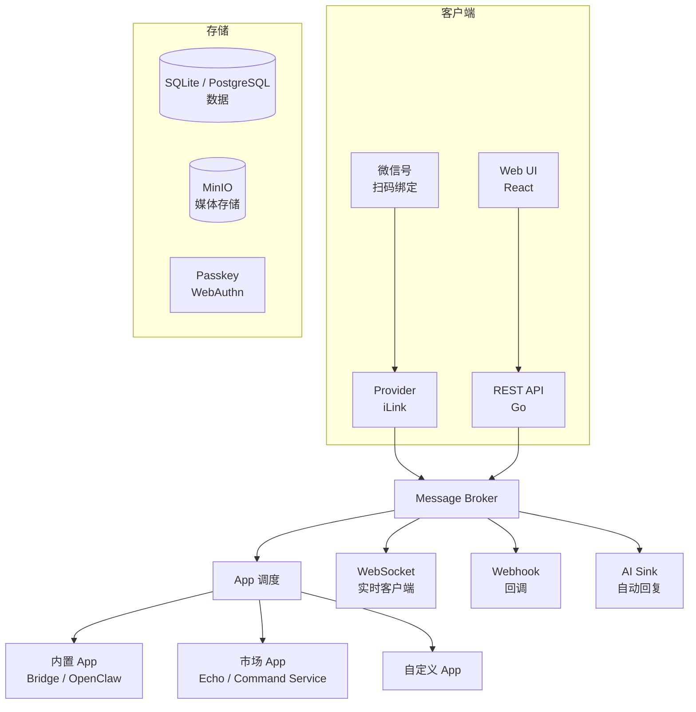

<div align="center">


**微信 ClawBot iLink 协议的开源消息管理平台 + App 应用市场**<br>
**Open-source message management platform + App Marketplace for WeChat ClawBot (iLink protocol)**

扫码绑定微信号，通过 App 应用市场扩展能力 —— 内置 Bridge / OpenClaw 等应用，支持 WebSocket / Webhook / AI 自动回复<br>
App 生态 · PKCE OAuth 安全安装 · 多 Bot 管理 · 7 种语言 SDK · Passkey 无密码登录

[](LICENSE)
[](https://go.dev)
[](https://react.dev)
[](docker-compose.yml)
[](https://github.com/openilink/openilink-hub/stargazers)
[](https://github.com/openilink/openilink-hub/releases)

[在线体验](https://hub.openilink.com) · [快速开始](#快速开始) · [App 应用市场](#app-应用市场) · [SDK 文档](#sdk-生态) · [English](#english)

</div>

---

## 快速开始

```bash
# 一键安装
curl -fsSL https://raw.githubusercontent.com/openilink/openilink-hub/main/install.sh | sh

# 启动
oih

# 或使用 Docker
docker run -d -p 9800:9800 ghcr.io/openilink/openilink-hub:latest
```

访问 `http://localhost:9800`，**首个注册用户自动成为管理员**。更多部署方式见 [部署指南](#部署指南)。

---

## 这是什么？

2026 年 3 月，微信正式推出 **ClawBot 插件**，底层协议叫 **iLink（智联）**，接入域名为 `ilinkai.weixin.qq.com` —— 微信官方首次开放个人号的 Bot API，你可以**合法地**让程序收发微信消息了。

**但 iLink 只是一个消息通道**：你扫码、收消息、发回复，仅此而已。要真正用起来，你还需要管理多个 Bot、路由消息到不同服务、处理媒体文件、接入 AI……

**OpeniLink Hub 就是干这个的。** 它把 iLink 的原始能力包装成一个完整的消息管理平台，并通过 **App 应用市场** 让你一键扩展功能：



<details>
<summary><b>和 OpenClaw 是什么关系？</b></summary>

OpenClaw 是一个 AI Agent Gateway 框架，微信 ClawBot 插件原生支持对接 OpenClaw。

在 OpeniLink Hub 中，OpenClaw 是一个**内置 App**——你可以在应用市场中一键启用它，将消息路由到 OpenClaw 进行 AI Agent 处理。当然你也可以完全不用 OpenClaw，选择其他 App 或直接用 WebSocket/Webhook 对接你自己的服务。

简单说：**OpenClaw 是 Hub 生态中的一个 App，Hub 本身是消息管理和 App 分发平台**，两者互补。

</details>

## 为什么选择 OpeniLink Hub？

| | OpeniLink Hub | 传统方案 |
|---|---|---|
| **App 生态** | 应用市场一键安装，内置 Bridge/OpenClaw，支持社区 App | 硬编码集成，难以扩展 |
| **部署方式** | 一行命令安装，零依赖 | 需要复杂的依赖配置 |
| **数据库** | 内置 SQLite（零配置）+ 可选 PostgreSQL | 必须配置外部数据库 |
| **多 Bot 管理** | 扫码绑定，集中管理多个微信号 | 通常只支持单个 Bot |
| **消息下发** | App + WebSocket + Webhook + AI 多通道并行 | 单一通道 |
| **安全机制** | PKCE OAuth 安装流程 + Passkey 无密码登录 | 仅密码认证 |
| **开源协议** | MIT，无商业限制 | 部分闭源或限制商用 |

## 核心特性

**App 应用市场**
Hub 内置应用市场，支持一键安装和管理 App。App 通过 PKCE OAuth 安全授权安装，可以接收消息事件、定义工具/命令、提供配置界面。内置 Bridge（消息桥接）和 OpenClaw（AI Agent），社区提供 Echo、Command Service 等更多 App。

**多 Bot 集中管理**
扫描二维码即可绑定微信号，支持同时管理多个 Bot，统一面板监控在线状态与消息统计。

**多通道消息下发**
- **App** — 已安装的 App 自动接收匹配的消息事件，通过 WebSocket 或 Webhook 投递
- **WebSocket** — 毫秒级实时推送，适合需要即时响应的场景
- **Webhook** — HTTP 回调，灵活对接任意服务
- **AI 自动回复** — 接入 OpenAI 兼容 API，Bot 自动与用户对话

**PKCE OAuth 安全安装**
App 安装采用 PKCE OAuth 流程，确保第三方 App 只能获得用户明确授权的权限，无需暴露密钥。

**现代化认证体系**
支持 Passkey（WebAuthn）生物识别 / 硬件密钥无密码登录，同时集成 GitHub、LinuxDo OAuth，多因素安全保障。

**完善的管理后台**
用户管理、角色权限、OAuth 配置、AI 全局设置、App 管理、Registry 管理，管理员一站式掌控。

## App 应用市场

Hub 的核心扩展机制是 **App 系统**。每个 App 是一个独立的服务，通过标准协议与 Hub 交互。

### App 类型

| 类型 | 说明 | 示例 |
|------|------|------|
| **内置 App** | 随 Hub 一起提供，无需额外部署 | Bridge（消息桥接）、OpenClaw（AI Agent） |
| **市场 App** | 从远程 Registry 安装，独立部署运行 | Echo（消息回显）、Command Service（命令服务） |
| **自定义 App** | 开发者自行开发的私有 App | 你的业务系统 |

### 安装 App

1. 在 Hub 管理后台进入「应用市场」
2. 浏览可用 App，点击「安装」
3. 通过 PKCE OAuth 授权流程完成安装
4. 配置 App 参数（如果 App 定义了配置 Schema）
5. App 开始接收消息事件

### 开发 App

App 通过以下方式与 Hub 交互：

- **接收事件**：通过 WebSocket 连接或 Webhook 回调接收消息事件
- **定义工具/命令**：App 可以声明 tools 和 commands，用户通过 @ 提及或命令触发
- **配置 Schema**：App 可以定义 JSON Schema，Hub 自动生成配置界面
- **发送回复**：通过 Hub API 发送消息回复

### 发布 App

开发者可以将 App 发布到 Registry，供其他 Hub 实例安装：

1. 开发并测试你的 App
2. 编写 App manifest（名称、描述、OAuth 回调等）
3. 提交到 Registry
4. 其他用户在应用市场中即可发现并安装

## 架构总览



## 部署指南

### 数据存储

默认使用内置 SQLite，数据库文件自动存储在平台标准目录：
- Linux: `~/.local/share/openilink-hub/openilink.db`
- macOS: `~/Library/Application Support/openilink-hub/openilink.db`
- root/service: `/var/lib/openilink-hub/openilink.db`

设置 `DATABASE_URL=postgres://...` 可切换到 PostgreSQL。

### 注册为系统服务

```bash
oih install                 # 安装 systemd (Linux) / launchd (macOS) 服务
oih uninstall               # 卸载服务
```

### Docker Compose（PostgreSQL + MinIO）

适合生产环境，数据存储在 PostgreSQL，媒体文件存储在 MinIO：

```yaml
services:
  postgres:
    image: postgres:17-alpine
    environment:
      POSTGRES_USER: openilink
      POSTGRES_PASSWORD: <改为强密码>
      POSTGRES_DB: openilink
    volumes:
      - pgdata:/var/lib/postgresql/data

  hub:
    image: ghcr.io/openilink/openilink-hub:latest
    ports:
      - "9800:9800"
    environment:
      DATABASE_URL: postgres://openilink:<密码>@postgres:5432/openilink?sslmode=disable
      RP_ORIGIN: https://hub.example.com
      RP_ID: hub.example.com
      SECRET: <随机字符串>
    depends_on:
      - postgres

volumes:
  pgdata:
```

前置 Nginx / Caddy 做 HTTPS 反向代理，将 443 端口转发到 9800。

### 从源码构建

```bash
# 构建前端
cd web && pnpm install && pnpm run build && cd ..

# 构建并运行
go build -o oih .
./oih
```

## CLI 命令

| 命令 | 说明 |
|------|------|
| `oih` | 前台运行服务 |
| `oih install` | 安装为系统服务（systemd / launchd） |
| `oih uninstall` | 卸载系统服务 |
| `oih version` | 显示版本信息 |

## SDK 生态

OpeniLink 提供 **7 种语言的官方 SDK**，方便你用熟悉的技术栈快速接入：

| 语言 | 仓库 | 安装方式 |
|------|------|---------|
| **Go** | [openilink-sdk-go](https://github.com/openilink/openilink-sdk-go) | `go get github.com/openilink/openilink-sdk-go` |
| **Node.js** | [openilink-sdk-node](https://github.com/openilink/openilink-sdk-node) | `npm install @openilink/openilink-sdk-node` |
| **Python** | [openilink-sdk-python](https://github.com/openilink/openilink-sdk-python) | `pip install openilink-sdk-python` |
| **PHP** | [openilink-sdk-php](https://github.com/openilink/openilink-sdk-php) | `composer require openilink/openilink-sdk-php` |
| **Java** | [openilink-sdk-java](https://github.com/openilink/openilink-sdk-java) | 从源码构建 |
| **C#** | [openilink-sdk-csharp](https://github.com/openilink/openilink-sdk-csharp) | 开发中 |
| **Lua** | [openilink-sdk-lua](https://github.com/openilink/openilink-sdk-lua) | 从源码引入 |

### 相关项目

| 项目 | 说明 |
|------|------|
| [openilink-app-echo](https://github.com/openilink/openilink-app-echo) | Echo App — 消息回显示例，App 开发参考模板 |
| [openilink-app-command-service](https://github.com/openilink/openilink-app-command-service) | Command Service App — 自定义命令服务 |
| [openilink-tg](https://github.com/openilink/openilink-tg) | Telegram Bot 集成，微信消息转发到 Telegram |
| [openclaw-channel-openilink](https://github.com/openilink/openclaw-channel-openilink) | OpenClaw 平台的 OpeniLink 适配器 |

## 环境变量

| 变量 | 默认值 | 说明 |
|------|--------|------|
| `LISTEN` | `:9800` | 监听地址 |
| `DATABASE_URL` | 平台标准路径下的 `openilink.db` | SQLite 路径或 PostgreSQL 连接串 |
| `RP_ORIGIN` | `http://localhost:9800` | 站点源地址（必须与浏览器访问地址一致） |
| `RP_ID` | `localhost` | WebAuthn RP ID，通常为域名 |
| `SECRET` | `change-me-in-production` | 服务端密钥，**生产环境必须修改** |
| `REGISTRY_URL` | — | 远程 App Registry 地址，用于从市场安装 App |
| `REGISTRY_ENABLED` | `true` | 是否启用远程 Registry |
| `GITHUB_CLIENT_ID` | — | GitHub OAuth Client ID |
| `GITHUB_CLIENT_SECRET` | — | GitHub OAuth Client Secret |
| `LINUXDO_CLIENT_ID` | — | LinuxDo OAuth Client ID |
| `LINUXDO_CLIENT_SECRET` | — | LinuxDo OAuth Client Secret |
| `STORAGE_ENDPOINT` | — | MinIO / S3 兼容存储端点 |
| `STORAGE_ACCESS_KEY` | — | 存储访问密钥 |
| `STORAGE_SECRET_KEY` | — | 存储密钥 |
| `STORAGE_BUCKET` | — | 存储桶名称 |
| `STORAGE_PUBLIC_URL` | — | 存储公开访问 URL |

## 配置 OAuth 登录

OAuth 为可选功能，配置后用户可使用第三方账号登录或绑定到已有账号。

<details>
<summary><b>GitHub OAuth</b></summary>

1. 前往 [GitHub Developer Settings](https://github.com/settings/developers) → OAuth Apps → New OAuth App
2. 填写：
   - **Homepage URL**: `https://hub.example.com`
   - **Authorization callback URL**: `https://hub.example.com/api/auth/oauth/github/callback`
3. 获取 Client ID 和 Client Secret，设置对应环境变量

</details>

<details>
<summary><b>LinuxDo OAuth</b></summary>

1. 前往 [connect.linux.do](https://connect.linux.do) 创建应用
2. 回调地址：`https://hub.example.com/api/auth/oauth/linuxdo/callback`
3. 获取 Client ID 和 Client Secret，设置对应环境变量

</details>

> 回调地址格式：`{RP_ORIGIN}/api/auth/oauth/{provider}/callback`，`RP_ORIGIN` 必须与实际访问地址完全一致。

## Provider 扩展

Bot 连接通过 Provider 接口抽象（`internal/provider/`），当前实现了 iLink Provider。新增 Provider 只需三步：

1. 在 `internal/provider/<name>/` 下实现 `provider.Provider` 接口
2. 在 `init()` 中调用 `provider.Register("name", factory)`
3. 在 `main.go` 中 `import _ ".../<name>"` 注册

## 技术栈

| 层 | 技术 |
|----|------|
| 后端 | Go 1.25, SQLite (modernc.org/sqlite) / PostgreSQL 17, gorilla/websocket |
| 前端 | React 19, Vite, TypeScript, Tailwind CSS |
| 认证 | WebAuthn (Passkey), OAuth 2.0 (PKCE), 密码 |
| App 系统 | PKCE OAuth 安装, WebSocket/Webhook 事件投递, JSON Schema 配置 |
| 存储 | MinIO / S3 兼容对象存储（可选） |
| 部署 | 单文件二进制 / Docker / Docker Compose |

## 参与贡献

欢迎提交 Issue 和 Pull Request！

- App 开发可参考 [openilink-app-echo](https://github.com/openilink/openilink-app-echo) 作为模板
- SDK 问题请到对应语言的仓库反馈

## License

[MIT](LICENSE) — 自由使用，无商业限制。

---

<div align="center">

**[OpeniLink](https://openilink.com)** · 让微信 Bot 接入更简单

</div>

---

<a name="english"></a>

## English

**OpeniLink Hub** is a self-hosted, open-source WeChat Bot management and message relay platform built on top of the **iLink protocol** — the official WeChat ClawBot Bot API launched in March 2026.

It turns WeChat's raw messaging capability into a manageable, routable, and extensible system: bind multiple WeChat accounts via QR code, then extend functionality through the **App Marketplace** — or forward messages to your services through WebSocket, Webhook, or AI auto-reply.

### Key Highlights

- **App Marketplace** — Install apps (Bridge, OpenClaw, Echo, Command Service) with one click via PKCE OAuth
- **Multi-bot management** — Bind and manage multiple WeChat accounts from a single dashboard
- **Multi-channel delivery** — Apps, WebSocket, Webhook, and AI auto-reply in parallel
- **PKCE OAuth** — Secure app installation flow, no secrets exposed
- **Passkey (WebAuthn)** — Passwordless login with biometric / hardware key support
- **Built-in SQLite** — Zero-config database with optional PostgreSQL upgrade
- **7 language SDKs** — Go, Node.js, Python, PHP, Java, C#, Lua

### Quick Start

```bash
# One-line install
curl -fsSL https://raw.githubusercontent.com/openilink/openilink-hub/main/install.sh | sh

# Start
oih

# Or use Docker
docker run -d -p 9800:9800 ghcr.io/openilink/openilink-hub:latest
```

Visit `http://localhost:9800` — the first registered user becomes admin.

For full documentation, see the Chinese sections above or visit [hub.openilink.com](https://hub.openilink.com).
